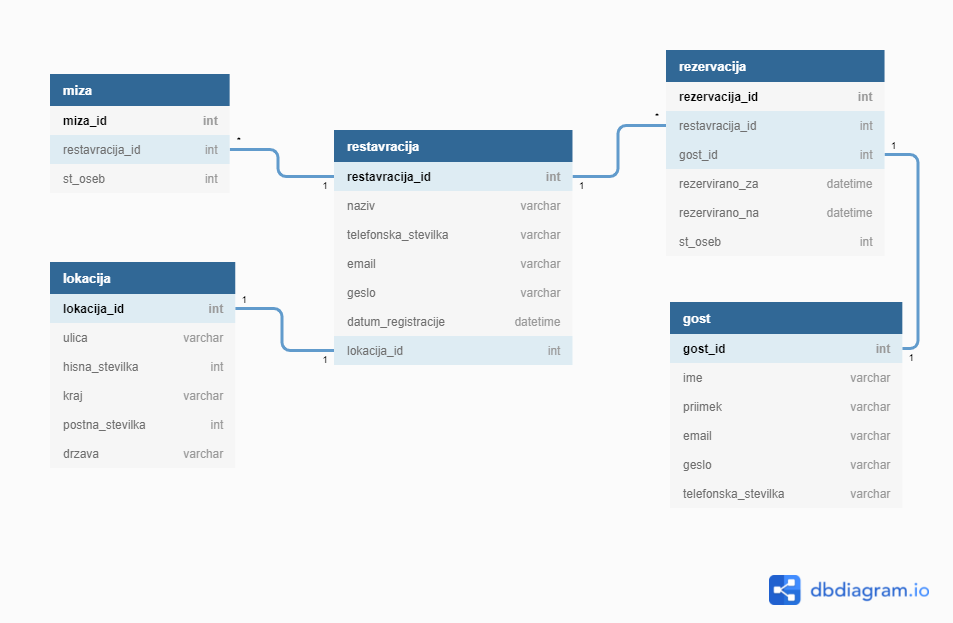

# Rezerviraj.si
 
Namen aplikacije rezerviraj.si je prehod na digitalno rezerviranje mize v izbrani restavraciji. Najina aplikacija omogoča prav to; pregled restavracij v izbranem mestu in rezerviranje mize za določeno število ljudi. Restavracijam pa omogoča pregled vseh rezervacij. 

Link do spletne aplikacije: https://rezerviraj-si.azurewebsites.net/  
API dokumentacija: [Link](https://rezerviraj-si.azurewebsites.net/swagger/index.html)

# Avtorja
**Denis Prelog (63190238)** - izdelava spletne aplikacije in podatkovne baze  
**Evan Apollonio (63190047)** - izdelava mobilne aplikacije

# Kako deluje?
Restavracija klikne na link za registracijo in se registrira. Izpolniti mora podatke o svoji lokaciji in nato lahko uporabniki oddajo rezervacijo pri njej.

Uporabnik pride na t.i. *landing page*, kjer ima možnost poiskati rezervacije v izbranem mestu ali pa gre na stran, kjer so objavljene vse restavracije. Od tam naprej lahko pogleda dodatne informacije o posamezni restavraciji ali pa kar direktno odda rezervacijo. Z klikom na gumb rezerviraj ga aplikacija najprej pelje na prijavo gostov, nato še izpolni vse podatke o rezervaciji. 

Ko se določena restavracija prijavi, lahko vidi vse svoje podrobne podatke, katere rezervacije je prejela, lahko dodaja ali briše mize in še več. 

# Podatkovna baza

Aplikacija ima podatke shranjene v SQL podatkovni bazi. Baza je gostovana na Microsoft Azure strežnikih.

V podatkovni bazi je skupno 5 tabel, zraven tega pa še dodatne tabele, ki so del ASP Identity paketa in se uporabljajo za prijavo in registracijo restavracije v spletno aplikacijo.

Najine tabele: 
- **Gost** - v tej tabeli so shranjeni vsi gostje. Vsak ima elektronski naslov in geslo, saj se je za oddajo rezervacije potrebno najprej prijaviti.
- **Restavracija** -  tu so vse restavracije. Vsaka ima svoj naziv, podatke za prijavo, podatke o lokaciji in vse mize v restavraciji. 
- **Miza** - so shranjene vse mize dodločene restavracije. Atribut *StMize* pomeni številko mize, da se natakarji lažje sporazumevajo. *StOseb* pa je vrednost, ki pove, za največ koliko ljudi je miza namenjena. 
- **Lokacija** - hrani podatke o lokacji določene restavracije. 
- **Rezervacija** - tu so shranjene vse oddane rezervacije. Shranjeni so podatki o tem, kdo je rezerviral, pri kateri restavraciji, kdaj, za kdaj in za koliko oseb.

Slika podatkovne baze (brez tabel paketa ASP Identity): 

